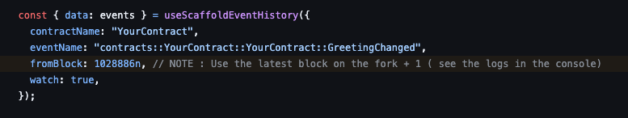

# Developing on Fork

This guide shows how to run and interact with a local fork of Starknet mainnet.

## Setup

1. Start the fork:

```bash
yarn chain --fork-network https://starknet-mainnet.public.blastapi.io/rpc/v0_7
```

2. After running yarn chain fork, there will be a block number in console:

```bash
Forking from block: number=1047693
```

- If you wanna use events, **MAKE SURE** the fromBlock : is > the number in console + 1, otherwise the events data will always be empty. i.e. do not capture the first block of the fork
  

3. Update `scaffoldConfig` in scaffold.config.ts as:

```typescript
const scaffoldConfig = {
  targetNetworks: [chains.mainnetFork],
  isFork: true, // handles forked network validation
  // ... other config options
};
```

4. Create a `.env` file from the `.env.example` template and configure it accordingly

```
NEXT_PUBLIC_PROVIDER_URL=http://127.0.0.1:5050
```

## Wallet Configuration

### Using Argent/Braavos

1. Open your wallet
2. Add Custom Network:
   - RPC URL: http://127.0.0.1:5050/rpc
   - Chain ID: 0x534e5f4d41494e
   - Name: Starknet Fork


similiarly for braavos.
if you correctly connected with the devnet correctly, it should show


## Interaction

Navigate to `/debug-ui` to interact with your contracts

## Notes

- Make sure your contract deployment is complete before testing
- The burner wallet is automatically configured with test ETH
- External wallets need to be configured with the correct network settings
